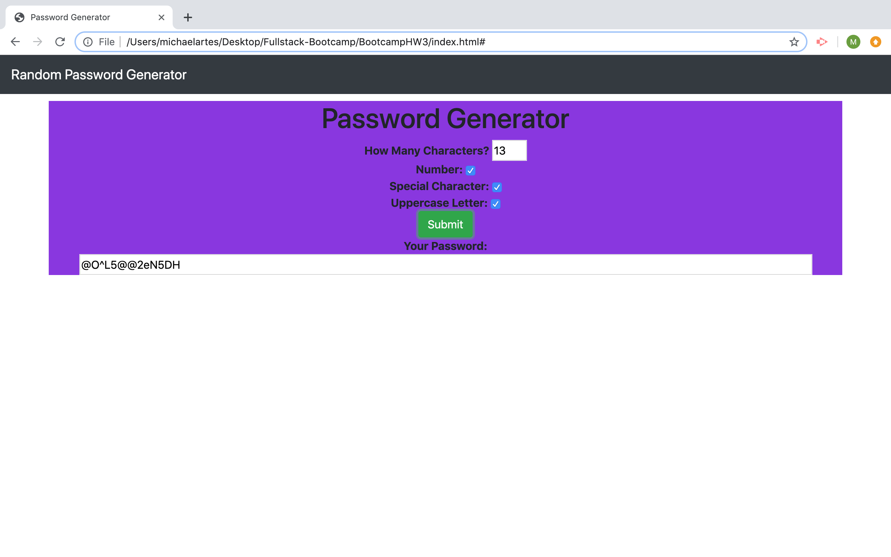

## BootcampHW3

For the project I created a "Random Password Generator" program, using Javascript. The program allows users to chose a length for the password using an input box. The user can also use the checkboxes to add additional elements to the password to increase security, these include: Number, Uppercase letter, and Special Character aka Symbols. When the user clicks on the "submit" button, a random password is generated and appears on the screen. 

## User Story

As a student in the JHU Fullstack Bootcamp program, this project helped to expand my knowledge of Javascript and its practical application in web development. Javascript allows webpages to go beyond only displaying content in various styles and layouts. Working with Javascript opens up the realm of user interativity on the web.

I want to continue to expand knowledge and experience working with Javascript, CSS, and HTML.

So that I can become an expert web developer and contribute to innovative and exciting work in the field.

## Business Context

A very high number of modern computer users rank having to create passwords as a leading source of technology based frustration. This program can relieve user stress, through the simple generation of a random, secure password. 

    
## Screenshot

 

 ## Link 

 <a href="https://michaelartes89.github.io/BootcampHW3/"> Clink Here for Link to Page </a>

## ENJOY!  

